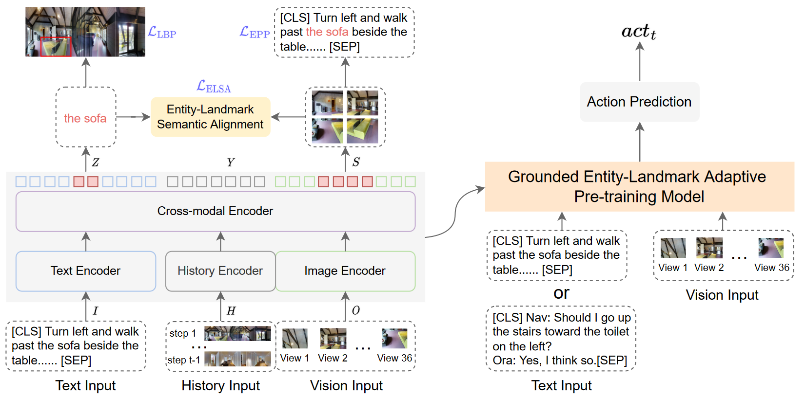

# Grounded Entity-Landmark Adaptive Pre-training for Vision-and-Language Navigation
This repository is the official implementation of **[Grounded Entity-Landmark Adaptive Pre-training for Vision-and-Language Navigation](https://arxiv.org/abs/2308.12587)** (ICCV 2023 Oral).

>Cross-modal alignment is one key challenge for Visionand-Language Navigation (VLN). Most existing studies concentrate on mapping the global instruction or single sub-instruction to the corresponding trajectory. However, another critical problem of achieving fine-grained alignment at the entity level is seldom considered. To address this problem, we propose a novel Grounded Entity-Landmark Adaptive (GELA) pre-training paradigm for VLN tasks. To achieve the adaptive pre-training paradigm, we first introduce grounded entity-landmark human annotations into the Room-to-Room (R2R) dataset, named GEL-R2R. Additionally, we adopt three grounded entity-landmark adaptive pretraining objectives: 1) entity phrase prediction, 2) landmark bounding box prediction, and 3) entity-landmark semantic alignment, which explicitly supervise the learning of fine-grained cross-modal alignment between entity phrases and environment landmarks. Finally, we validate our model on two downstream benchmarks: VLN with descriptive instructions (R2R) and dialogue instructions (CVDN). The comprehensive experiments show that our GELA model achieves state-of-the-art results on both tasks, demonstrating its effectiveness and generalizability.



## Requirements

1. Install Matterport3D simulators: follow instructions [here](https://github.com/peteanderson80/Matterport3DSimulator).
```
export PYTHONPATH=Matterport3DSimulator/build:$PYTHONPATH
```

2. Install requirements:
```setup
conda create --name VLN-GELA python=3.8.5
conda activate VLN-GELA
pip install -r requirements.txt
```
3. Download datasets from Baidu Netdisk, including processed annotations, features and pre-trained models of R2R and CVDN datasets. Put the data in `datasets` directory.

4. Download the GEL-R2R dataset from [Baidu Netdisk](https://pan.baidu.com/s/12WTzZ05T8Uxy85znn28dfQ?pwd=64t7). Put the data in `datasets/R2R/annotations/GELR2R` directory.

## Adaptive Pre-training

Grounded entity-landmark adaptive pre-training:
```adaptive pre-train
bash ada_pretrain_src/pretrain_r2r.sh
```

## Fine-tuning & Evaluation

```finetune
cd finetune_src
bash scripts/run_r2r.sh # (run_cvdn.sh)
```

## Citation

```bibtex
@InProceedings{Cui_2023_ICCV,
    author    = {Cui, Yibo and Xie, Liang and Zhang, Yakun and Zhang, Meishan and Yan, Ye and Yin, Erwei},
    title     = {Grounded Entity-Landmark Adaptive Pre-Training for Vision-and-Language Navigation},
    booktitle = {Proceedings of the IEEE/CVF International Conference on Computer Vision (ICCV)},
    month     = {October},
    year      = {2023},
    pages     = {12043-12053}
}
  ```

## Acknowledgments
Our code is based on [VLN-HAMT](https://github.com/cshizhe/VLN-HAMT), [EnvEdit](https://github.com/jialuli-luka/EnvEdit) and [MDETR](https://github.com/ashkamath/mdetr). Thanks for their great works!
